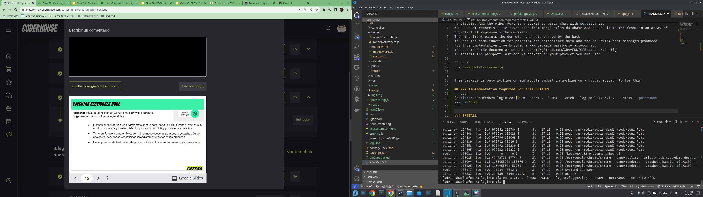
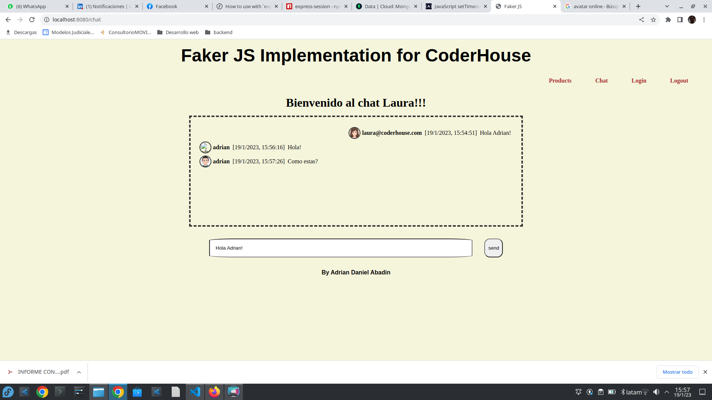

#**Sessions File Storage Feat**

This backend contains two features, the first one is a fake products api with a static view builded through handlebars. And the other Feat is a socket io basic chat with persistance.
When socket connects it retrives data from mongo atlas database and pushes it to the front in an array of objects that represents the menssage.
Then the front paints the dom with the data pushed by the back.
it uses the same function for painting the persistance data and the following chat messages produced.
For this implentation i ve builded a NPM package passport-fast-config.
You can read the documentation on: https://github.com/GRAVEDDIGER/passportConfig
TO install the passport-fast-config package in your project you can use:

```bash
npm passport-fast-config
```

This package is only working on ecm module import im working on a hybrid aproach to for this

## PM2 Implementation required for this FEATURE

```bash
pm2 start ./src/run.js --name=run1 --log Fork.log -- start --port=8081
pm2 start ./src/run.js --name=run2 -i max --log Fork.log -- start --port=8080
start nginx
```

## NGINX CONFIG

```js
events {}
http {
    include mime.types;
    default_type application/octet-stream;
    upstream node_app {

        server localhost:8081;
        }
    upstream random_app{
        server localhost:8080/random;
    }
    server{
        server_name localhost:8080;
        listen 80;

    location / {
        proxy_pass node_app;
    }
    location /random {
        proxy_pass random_app;
    }
    }

}
```



### INSTALL:

```bash
npm install
```

### EXECUTION:

```bash
npm start
npm run test
```

### DEPENDENCES:

1. EXPRESS
2. MORGAN
3. VITEST
4. EXPRESS-HANDLEBARS
5. FAKER
6. COLORS
7. MONGOOSE
8. SOCKET IO
9. Express-Session
10. Session-File-Storage
11. Passport
12. Passport Local
13. Passport Google oAuth2.0
14. passport-fast-config

### STATIC VIEW:



